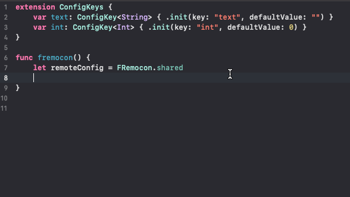

# FRemocon
<p align="center">
  
  
  <a href="https://developer.apple.com/swift">
    
  </a>
  <a href="./LICENSE">
    
  </a>
  <a href="https://twitter.com/_funzin">
    
  </a>
</p>

- FRemocon can get the [FirebaseRemoteConfig](https://firebase.google.com/docs/remote-config) value type-safely by using Key Path Member Lookup
- This repository is inspired by [sunshinejr/SwiftyUserDefaults](https://github.com/sunshinejr/SwiftyUserDefaults), [sgr-ksmt/Lobster](https://github.com/sgr-ksmt/Lobster)



## Environment
- Xcode 12.4 or greater
- Swift 5.3 or greator

## Installation
### Swift Package Manager
Add the following code in `Package.swift`.
```Package.swift
dependencies: [
    .package(url: "https://github.com/funzin/FRemocon.git", from: "0.1.0"),
]
```
### CocoaPods
Add the following code in `Podfile`.
```Podfile
pod 'FRemocon'
```

## Usage
1. Add the key set in Firebase RemoteConfig as `ConfigKey`
```swift
extension ConfigKeys {
    var text: ConfigKey<String> { .init(key: "text", defaultValue: "defaultValue") }
    var flag: ConfigKey<Bool> { .init(key: "flag", defaultValue: false) }
    var intNumber: ConfigKey<Int> { .init(key: "intNumber", defaultValue: 1) }
}
```

2. The value will be accessible through `ConfigKey`
```swift
let remoteConfig = FRemocon.shared
remoteConfig.fetch() { (status, error) -> Void in
  if status == .success {
    print("Config fetched!")
    remoteConfig.activate() { (changed, error) in
      // Value obtained by RemoteConfig
      let text: String = remoteConfig.text
      print(text: \(text))
    }
  } else {
    print("Config not fetched")
    print("Error: \(error?.localizedDescription ?? "No error available.")")
  }
  self.displayWelcome()
}
```

### Supported types
Currently support the following types
|Name|
|:-:|
|Int|
|Float|
|Double|
|String|
|Coudable|
|RawRepresentable|

### Get/Set to RemoteConfig value
Can get / set the `FirebaseRemoteConfig` value by using Key Path Member Lookup.
#### Get
```swift
// before
let lastFetchStatus = RemoteConfig.remoteConfig().lastFetchStatus

// after
let lastFetchStatus = FRemocon.shared.lastFetchStatus
```

#### Set
```swift
// before
RemoteConfig.remoteConfig().configSettings = RemoteConfigSettings()

// after
FRemocon.shared.configSettings(RemoteConfigSettings())
```

## GoogleService-Info
Use [GoogleService-Info](./Resources/GoogleService-Info.plist) similar to [mock-GoogleService-Info](https://github.com/firebase/quickstart-ios/blob/master/mock-GoogleService-Info.plist)

## Development
1. `git clone https://github.com/funzin/FRemocon`
2. `open FRemocon.xcodeproj`

## Contact
If you discover problem or have some opinions, please let me know through Github issues💁‍♂️

## Author
funzin
- mail: nakazawa.fumito@gmail.com

## License
Rimuru is available under the MIT license. See the [LICENSE](./LICENSE) file for more info.
